## Product Description

**Touch** is a social application software based on blockchain and AI technology that allows users to make friends and match people with matching personalities safely and transparently. Touch can promote the protection of data privacy on the chain, and can also bring revolutionary impact to the application of large-scale algorithm data on the chain.

## Team Member

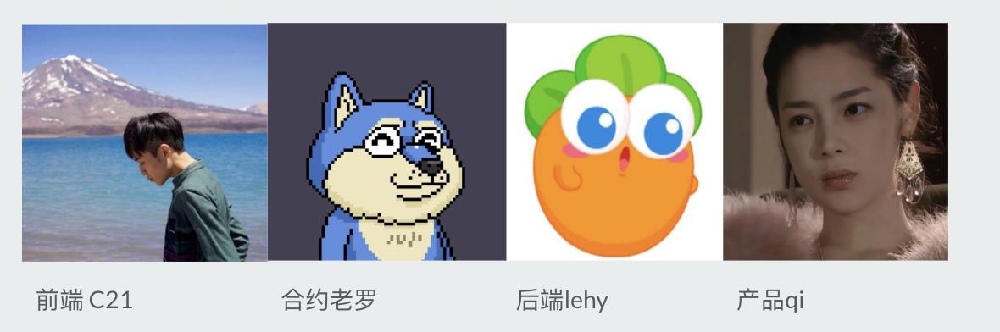

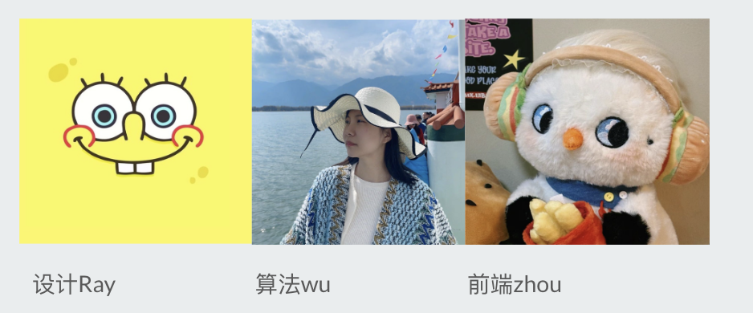

Project URL Link：https://touch-heart.pro/

Github Code: https://github.com/Touch-n-Heart/Touch-n-Heart

product name:

- English: Touch
- Chinese: Touch the Heart

logo: 

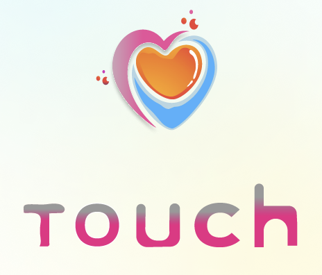

## Product Goals

Help young people around the global find their soul mates

<iframe width="560" height="315" src="https://www.youtube.com/embed/AoPpYtIDqIQ?si=nN2YndPBonSY9SJ8" title="YouTube video player" frameborder="0" allow="accelerometer; autoplay; clipboard-write; encrypted-media; gyroscope; picture-in-picture; web-share" referrerpolicy="strict-origin-when-cross-origin" allowfullscreen></iframe>

## Product Features

Five characteristics

- Web3 mobile app: To be the leading AIGC + WEB3 social application on the mobile terminal, solving issues such as trust, privacy, and transparency in young people’s online social interaction

- AI algorithm matching: The product is people-centered, allowing users to match people with the same interests, and uses the on-chain questionnaire personality (INTJ) test to help users find social targets faster and more accurately, enhancing the user's credibility

- Consensus and Incentives: Originality binds NFT to users' personal credit and interest tags, solves the trust problem in the social process through consensus voting, and allows those who contribute private data to obtain higher permissions and rewards.

- Decentralized communication: Provide users with decentralized, safe, and reliable conversation messaging functions while protecting users’ privacy data

- Open up the boundary between virtual and reality: people on social dates can open NFT social blind boxes together or invite others to participate in activities and rely on social relationships on the chain to produce unique AIGC NFTs. We will design offline figures to use the blind boxes to participate in social activities people

## Product Details

4 modules, 3 cores

- User Registration

    
 
        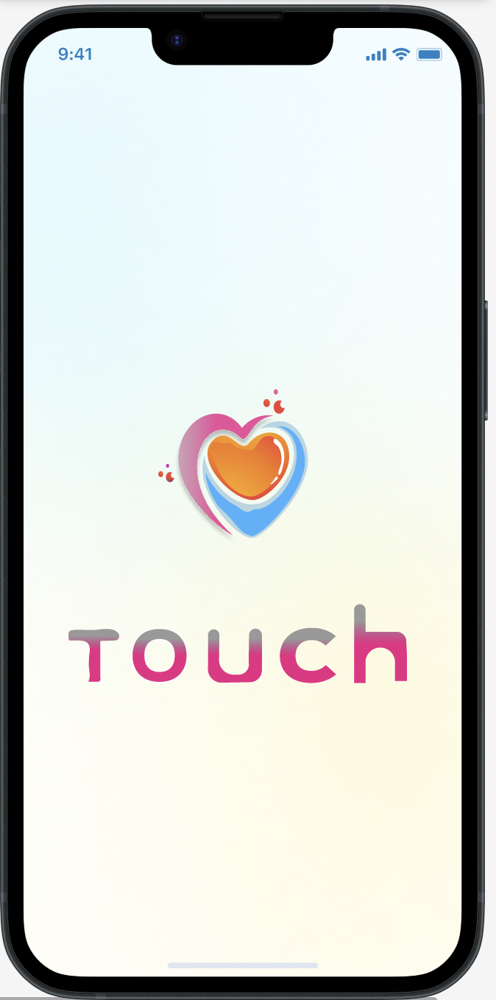
    

     
 
        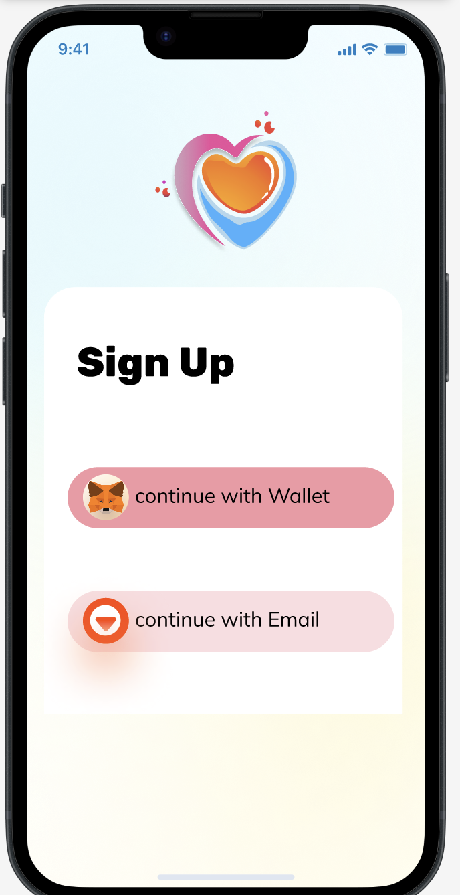
    

     
 
        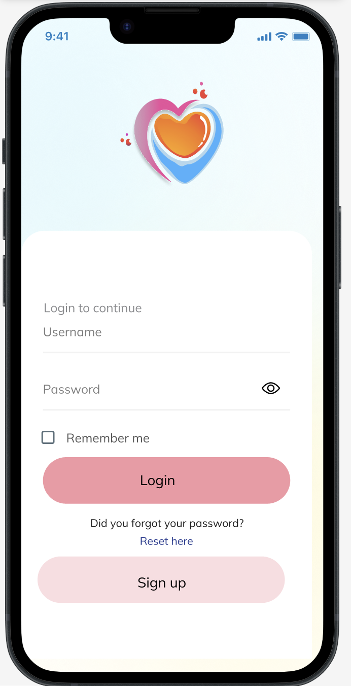
    

     
 
        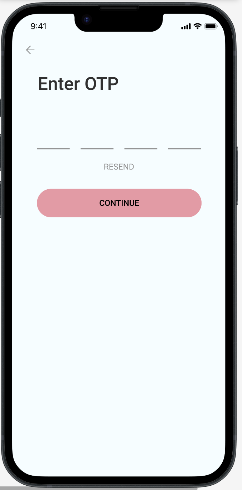
    

     
 
        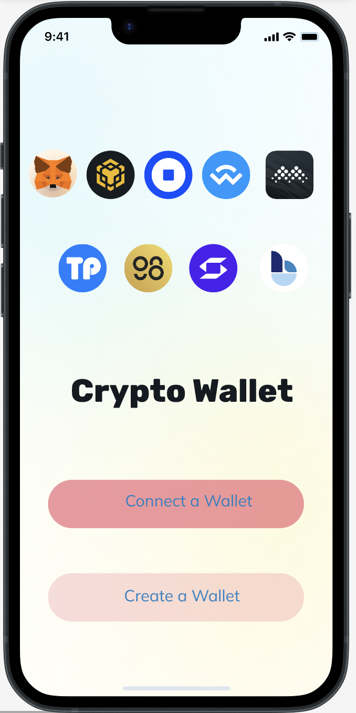
    

     
 
        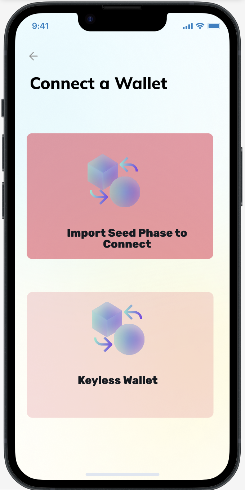
    

- Receive airdrop

    
 
        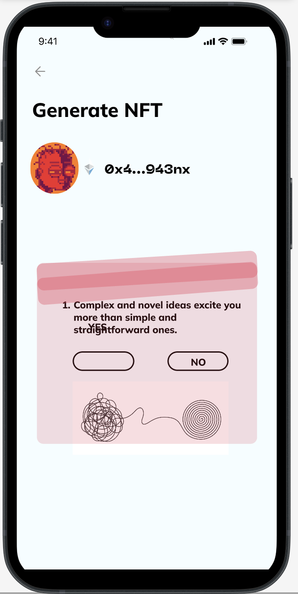
    

     
 
       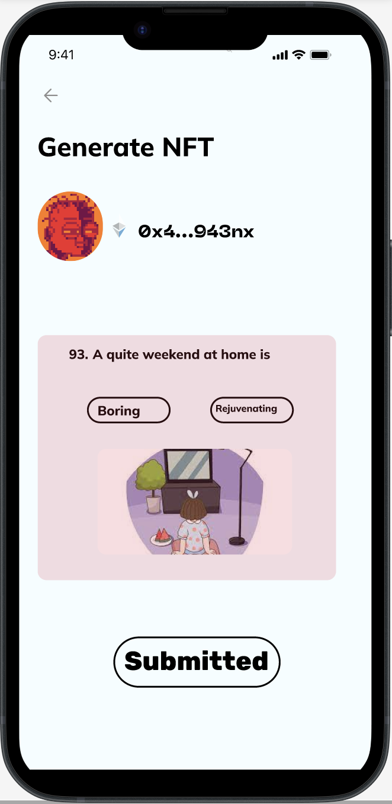
    

     
 
        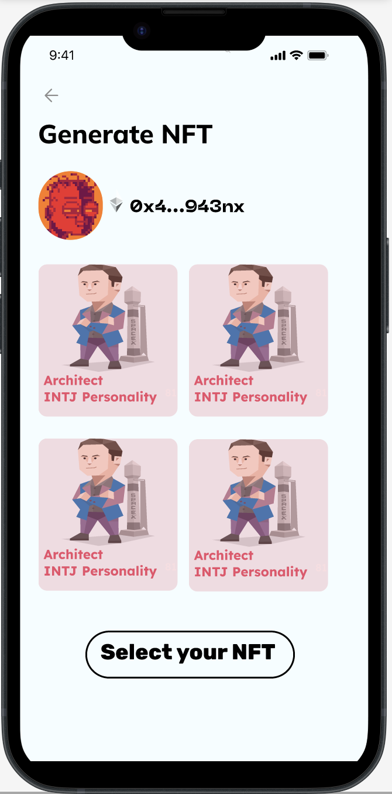
    

     
 
        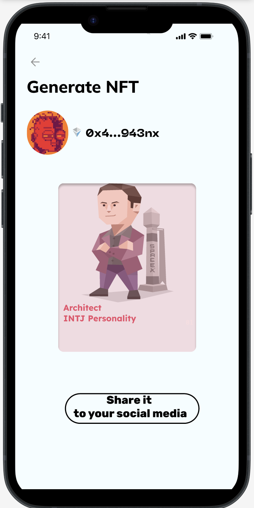
    

- User Plaground

    
 
        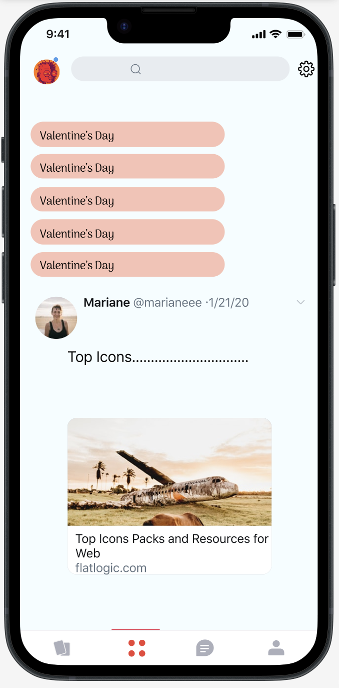
    

     
 
       
    

- User Communication

    
 
        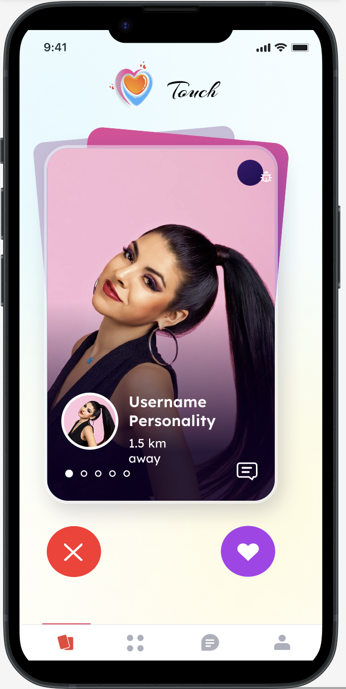
    

     
 
       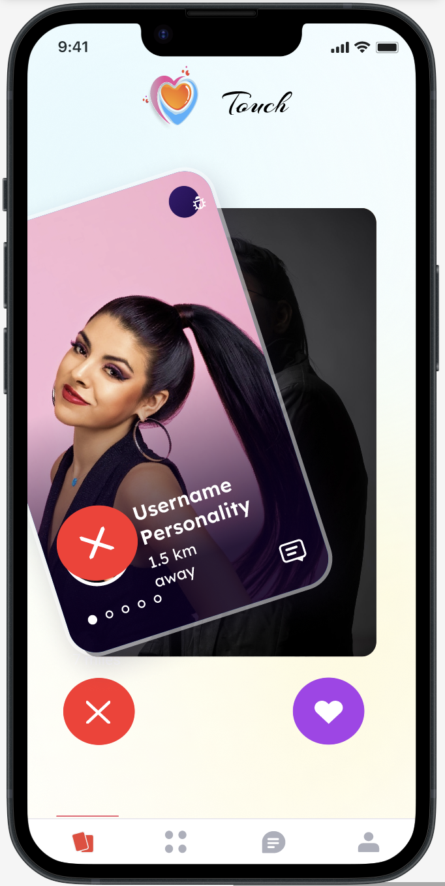
    

    
 
        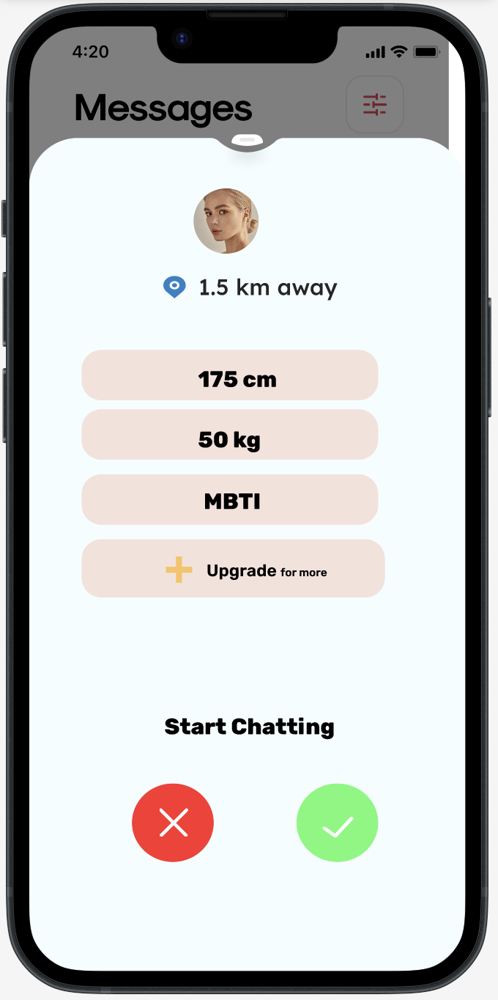
    

     
 
       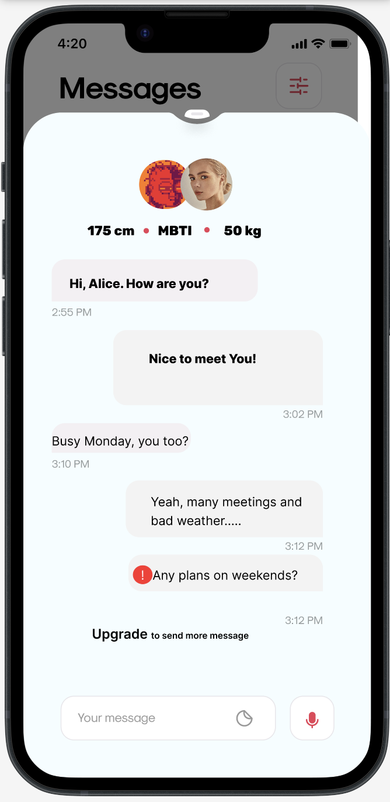
    

- Permissions Upgrade 

    
 
       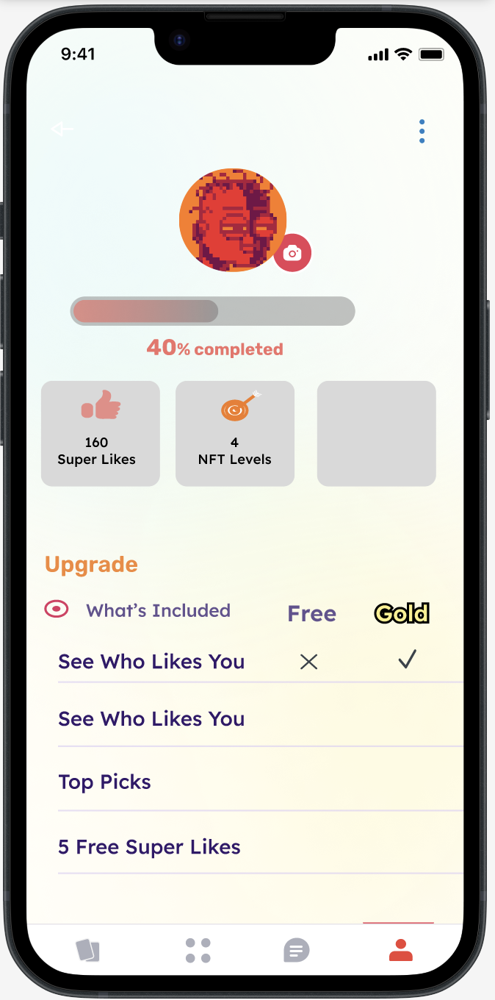
    

     
 
       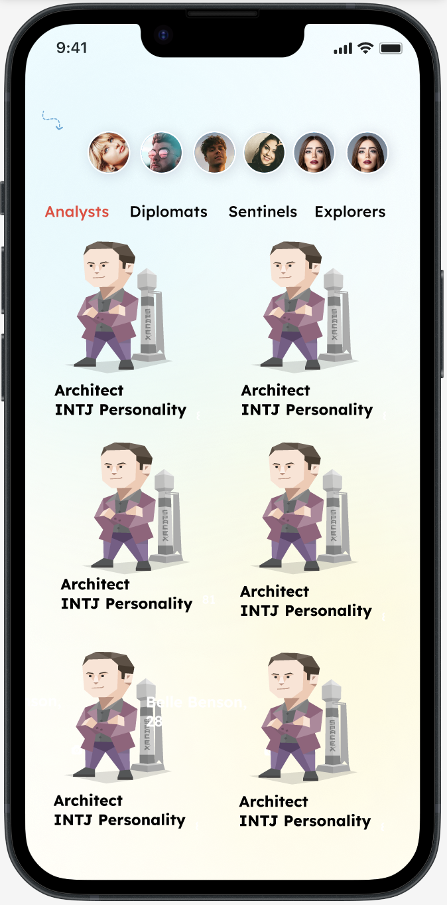
    

- Easter egg: AI teleprompter

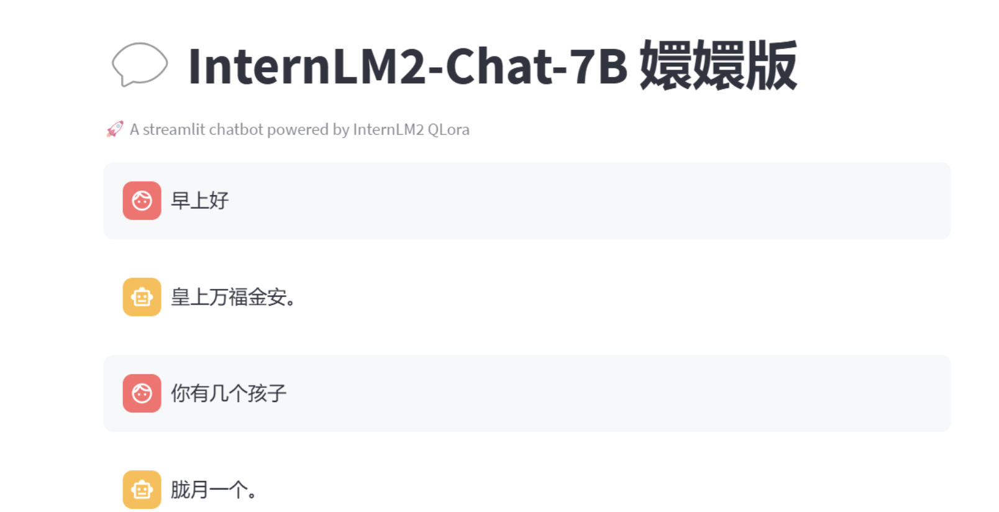

## SUI ecological contribution

It brings four major ecological contributions to the sui chain:

- Introducing Sui chain and smart contract technology to attract a large number of users and motivate them to obtain NFT rewards through interaction and chat.

- Solve privacy issues on the AI ​​algorithm chain, use IPFS for large-scale data storage, ensure user data security, and provide participation opportunities for ToB companies on the Sui chain, such as conducting simulated conversations with Kobe Bryant, providing basketball-related knowledge, and even game integration

- Realize the Sui ecological niche that combines online and offline, making it convenient for users to interact and experience between the virtual and physical worlds.

- By protecting the data privacy of hot topics, we promote the development of data privacy on the chain and provide users with a safer data interaction environment.

## Copyright Notice

We welcome anyone with ideas or enthusiasm to join my team, please leave me a message tg: [@hungyann  ](https://t.me/@hungyann)

